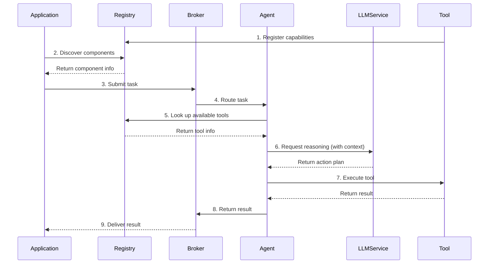

# AFEAF Architecture

## System Overview
AFEAF (Automated Framework for Enterprise AI Functions) is a distributed system that enables seamless integration and orchestration of AI components.

## Core Components

### 1. Registry Service
- Central catalog of all system components
- [Detailed Documentation](registry.md)
- Key Features:
  - Component registration and discovery
  - Metadata management
  - Health tracking
- Component Types:
  - Applications: Event monitors, standalone apps, etc.
  - Services: Core AFEAF services
  - Tools: Reusable capabilities

### 2. Message Broker
- [Detailed Documentation](broker.md)
- Lightweight ZeroMQ-based messaging system
- Key Features:
  - Decentralized pub/sub messaging
  - Direct component-to-component communication
  - No central broker/server needed
  - Low latency message passing
- Core Channels:
  - tasks/new: Task submissions
  - tasks/progress: Status updates
  - tasks/complete: Results
  - system/health: Health checks
  - system/config: Configuration
  - system/control: Control messages

### 3. LLM Service
- [Detailed Documentation](llm_service.md)
- Centralized gateway for LLM interactions
- Key Features:
  - Unified API for model access
  - Cost tracking and optimization
  - Response caching
  - Rate limiting
  - Async and batch processing
  - Multi-provider support

### 4. Tools
- Independent components providing specific capabilities
- Key Features:
  - Self-registration with Registry
  - Standardized interfaces
  - Input/output schema validation
  - Direct execution of capabilities
- Examples:
  - Data processing tools
  - Integration tools (email, calendar, etc.)
  - Analysis tools
  - Custom enterprise tools

### 5. Agents
- Independent task execution components
- Key Features:
  - Task execution and orchestration
  - LLM-powered reasoning
  - Tool discovery and usage
  - Status reporting via Broker

> **Future Extension**: Agent Service
> For production scaling, consider adding an Agent Service layer for:
> - Agent lifecycle management
> - Resource allocation and load balancing
> - Multi-agent coordination
> - Performance monitoring
> - State persistence
> - Security context management

## Component Interaction

## Data Flow
1. Component Registration (Tools, Applications register themselves)
2. Component Discovery
3. Task Submission
4. Task Routing
5. Tool Discovery
6. Agent Reasoning (via LLM)
7. Tool Execution
8. Result Aggregation
9. Response Delivery

## Security Model
- Component-level authentication
- Request validation
- Access control
- Audit logging

## Deployment
- Containerized components
- Configuration management
- Health monitoring
- Scaling policies

## Development Guidelines
1. [Registry Service Guidelines](registry.md)
2. [Message Broker Guidelines](broker.md)
3. [LLM Service Guidelines](llm_service.md)
4. Tools Service Guidelines (TBD)
5. Agents Service Guidelines (TBD) 