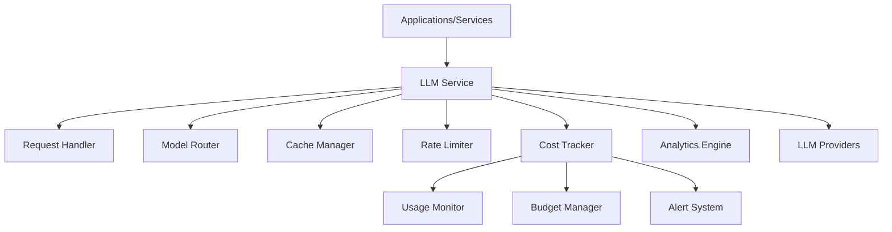

# LLM Service

## Overview
The LLM Service acts as a centralized gateway for all LLM interactions within the AFEAF ecosystem. It provides unified model access, cost tracking, and optimization capabilities across all applications and services.

## Architecture


## Core Features
- Unified API for model access
- Model selection and versioning
- API key management
- Response caching
- Rate limiting
- Cost tracking and optimization
- Sync/async operations
- Batch processing
- Usage analytics
- Budget management

## Component Integration

### Request Flow
1. Client sends request to LLM Service
2. Request Handler validates and normalizes input
3. Model Router selects appropriate provider
4. Cache Manager checks for existing responses
5. Rate Limiter ensures quota compliance
6. Cost Tracker monitors usage
7. Response returned to client

### Message Schemas

#### Request Schema
```json
{
  "request": {
    "model": "string",
    "messages": [{
      "role": "string",
      "content": "string"
    }],
    "options": {
      "temperature": "float",
      "max_tokens": "integer",
      "stream": "boolean",
      "cache": "boolean",
      "async": "boolean",
      "batch_id": "string"
    },
    "metadata": {
      "source_id": "string",
      "source_type": "string",  // "application" or "service"
      "priority": "integer",
      "budget_id": "string"
    }
  }
}
```

#### Usage Event Schema
```json
{
  "usage_event": {
    "timestamp": "datetime",
    "source": {
      "type": "string",  // "application" or "service"
      "id": "string"
    },
    "request_type": "string",
    "tokens": {
      "prompt": "integer",
      "completion": "integer"
    },
    "model": "string",
    "cost": "float",
    "metadata": {
      "async": "boolean",
      "cached": "boolean",
      "batch_id": "string",
      "budget_id": "string"
    }
  }
}
```

## Security Model
- API key management
- Request authentication
- Rate limiting
- Usage quotas
- Budget enforcement
- Audit logging

## Monitoring
- Request metrics
- Cost tracking
- Cache performance
- Provider availability
- Budget utilization
- System health

## Future Extensions
1. Advanced caching strategies
2. Dynamic model selection
3. Cost optimization algorithms
4. Multi-region support
5. Custom model integration 