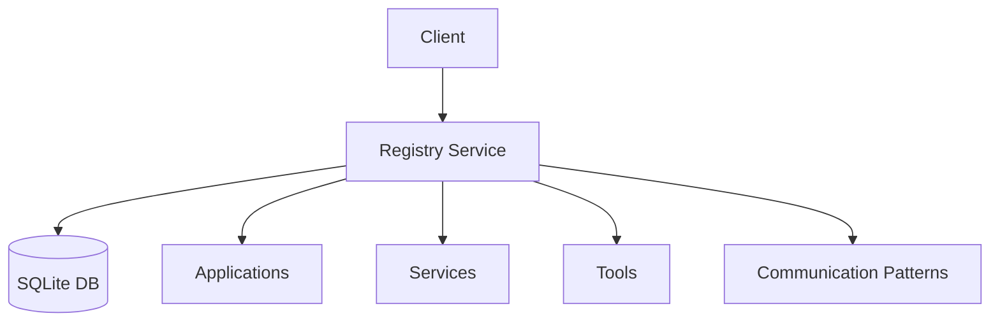

# Registry Service

## Overview
The Registry Service is a central component of AFEAF that maintains a catalog of all available components and their communication endpoints. It enables dynamic discovery for both public broker-based and private direct communication patterns within the AFEAF ecosystem.

## Architecture


## Component Types

### Applications
- External components that interact with AFEAF
- Examples:
  - Email watchers (private data handlers)
  - Calendar monitors (private data handlers)
  - Standalone LLM applications
  - Custom integrations
- Must provide:
  - Health check endpoint
  - Resource requirements
  - Integration points
  - Communication patterns (public/private)
  - Security requirements

### Services
- Core AFEAF system services
- Examples:
  - Registry Service
  - Message Broker (public events only)
  - LLM Service
  - Tools Service
  - Agents Service
- Must provide:
  - Health check endpoint
  - API documentation
  - Service dependencies
  - Communication patterns
  - Security context

### Tools
- Reusable capabilities
- Examples:
  - Text processors
  - Data transformers
  - API integrations
- Must provide:
  - Input/output schemas
  - Resource requirements
  - Version information
  - Data privacy requirements

## Communication Patterns

### Public Communication
- Uses Message Broker
- System-wide events
- Service discovery
- Health updates
- Resource availability

### Private Communication
- Direct service-to-service
- Sensitive data handling
- Stateful interactions
- Secure endpoints
- Authentication requirements

## Integration Guide

### Registering Components
Components can be registered via HTTP POST request:
```bash
POST http://registry:5000/registry
```

Example registration payload:
```json
{
  "component": {
    "id": "string",
    "name": "string",
    "type": "string",  // "application", "service", or "tool"
    "description": "string",
    "version": "string",
    "endpoints": {
      "health": "string",
      "api": "string",
      "private": {
        "url": "string",
        "protocol": "string",
        "auth_required": "boolean"
      }
    },
    "communication_patterns": {
      "public_channels": ["string"],
      "private_endpoints": {
        "roles": ["string"],
        "protocols": ["string"]
      }
    },
    "dependencies": [{
      "id": "string",
      "version": "string",
      "required": "boolean"
    }],
    "metadata": {
      "resources": {
        "cpu": "string",
        "memory": "string"
      },
      "owner": "string",
      "documentation": "string",
      "privacy_level": "string",  // "public", "private", "mixed"
      "security_requirements": ["string"]
    }
  }
}
```

### Component Discovery
Components can be discovered through:
1. Direct lookup by ID
2. Type-based filtering
3. Active component listing
4. Communication pattern filtering
5. Security context matching

### Health Checks
The registry maintains component health through:
- Status tracking (active/inactive)
- Last update timestamps
- Soft deletion support
- Communication pattern status

## Security Considerations
- Currently uses basic HTTP for POC
- Production must implement:
  - Strong authentication
  - HTTPS/TLS
  - Rate limiting
  - Access control
  - Endpoint encryption
  - Privacy validation

## Best Practices

1. Communication Pattern Selection
   - Use public channels for system events only
   - Use direct communication for sensitive data
   - Validate security requirements
   - Monitor communication health

2. Service Registration
   - Clearly specify privacy requirements
   - Document security contexts
   - Maintain endpoint information
   - Update health status regularly

3. Service Discovery
   - Verify security requirements
   - Validate communication patterns
   - Check health status
   - Monitor connection status

## Future Extensions
1. Component versioning
2. Dependency tracking
3. Health monitoring
4. Access control
5. Component metrics
6. Privacy compliance monitoring
7. Security context management
8. Communication pattern analytics 