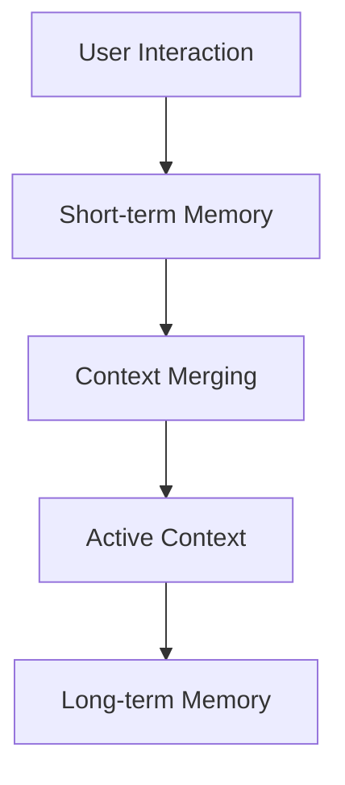

# Memory in AFEAF

Memory is the foundational mechanism that enables AI agents in AFEAF to maintain context and continuity in their interactions with users. Inspired by the concepts outlined in mem0 (https://gitingest.com/mem0ai/mem0), this document describes how memory is handled in our system.

## Overview

Memory in AFEAF can be categorized into:
- Short-term Memory: Temporary, ephemeral memory for immediate context.
- Long-term Memory: Persistent storage of historical context, decisions, and patterns.
- Active Context: The current working memory that directly influences decision making.

## Design Principles

Our memory design is guided by:
- Consistency: Structured memory ensures uniform understanding and traceability.
- Simplicity: Ease of use and clarity for both development and demonstration.
- Extensibility: Designed to accommodate future enhancements and integrations.

## Memory Architecture

The memory mechanism is implemented following a clear data flow:

1. Data Capture: Interactions are logged and relevant data is stored.
2. Context Merging: Short-term interactions are merged with long-term historical data.
3. Active Context Formation: The current context is maintained for decision-making.
4. Long-term Memory Update: Historical data is periodically updated with insights.

## Implementation Considerations

- Memory documents are stored as Markdown files as part of the Memory Bank to ensure version control and clarity.
- Upon each interaction, the system ingests all memory documents (e.g., projectbrief.md, productContext.md, activeContext.md, systemPatterns.md, techContext.md, progress.md) to build a complete context.
- Future work may explore dedicated memory databases or caching mechanisms for improved performance.

## Conclusion

This document outlines the strategy for memory management in AFEAF. It serves as a cornerstone for understanding how past interactions shape current decisions and future enhancements. The design aims to balance simplicity, consistency, and extensibility. 